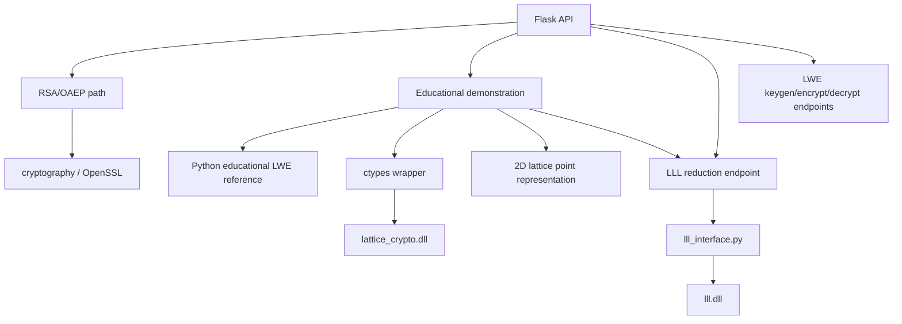

# RSA versus LWE Architecture

## Scope

This repository is an educational software project. It contains three separate technical paths:

1. RSA-OAEP encryption and decryption.
2. An educational n-dimensional LWE-style encryption/decryption construction, implemented as a Python reference and a separate native C backend.
3. Lattice basis analysis through the existing native C LLL implementation.

The LWE construction is intentionally educational and is not a production cryptosystem. LLL is a basis-reduction and analysis component. It is not used by the LWE encryption or decryption path.

The blockwise UTF-8 encoding has no finite cryptographic plaintext capacity: messages are split into additional independent blocks, and the ciphertext records the exact byte length. The API reports this as `unbounded_by_lwe_parameters`; practical limits are transport and system-resource limits. Lossless byte encoding requires `message_modulus >= 256`.

## Component Map



## RSA/OAEP

The RSA path is independent of the lattice paths.

Relevant modules:

- `backend/rsa/key_generation.py`
- `backend/rsa/encryption.py`
- `backend/rsa/decryption.py`
- `backend/verification/verifier.py`

The encryption path uses the `cryptography` package with RSA-OAEP, SHA-256, and MGF1 using SHA-256. Plaintext is converted to UTF-8 bytes, checked against the OAEP capacity for the selected key size, encrypted, and returned as Base64 ciphertext.

The decryption path validates Base64 input and ciphertext length, loads the PEM private key, decrypts with the same OAEP parameters, and decodes the result as UTF-8 with a Latin-1 fallback.

RSA/OAEP does not call the LWE backend, the ctypes wrapper, or LLL.

## Educational LWE Reference

The reference implementation is `backend/lattice/educational_lwe.py`. It is the mathematical authority for the educational construction.

### Parameters

The validated parameter set contains:

- `dimension`: `n`, constrained to `[2, 64]` by the Python validator.
- `modulus`: odd lattice modulus `q`.
- `message_modulus`: symbol modulus `p`.
- `noise_bound`: bound for small secret and error values.
- `samples`: number of rows in the public matrix, with `samples >= dimension`.

The validator also derives and requires:

- `floor(modulus / message_modulus) > 0`
- `samples * noise_bound + noise_bound + dimension * noise_bound ** 2 < floor(floor(modulus / message_modulus) / 2)`

The default Python parameters use `dimension = 4`, `q = 2**127 - 1`, `p = 256`, `noise_bound = 2`, and `samples = 8`. The condition `p ** n < q` is not required because symbols are encoded independently, not as one integer-valued block.

### Key Generation

The implementation samples:

- $A \leftarrow \mathbb{Z}_q^{m \times n}$ uniformly, where `m = samples`.
- $s \in \{-\text{noise_bound}, \ldots, \text{noise_bound}\}^n$.
- $e \in \{-\text{noise_bound}, \ldots, \text{noise_bound}\}^m$.

It computes:

$$
b = A s + e \pmod q
$$

The public key contains `(A, b)`. The private key contains `s`.

The Python public/private key dictionaries do not retain `e` as a field. The demonstration derives the small error vector from the public values and toy secret for display only.

### Message Encoding

A plaintext string is encoded as UTF-8 bytes. Bytes are grouped into blocks of length `n`. The final block is zero-padded. Each block is represented as:

$$
m = [m_0, \ldots, m_{n-1}] \in \mathbb{Z}_p^n
$$

For the benchmark and complete demonstration, `p = 256`, so byte values are represented directly.

### Encryption

For each component of each message block, the implementation samples a binary vector `r`, a small vector `e1`, and a small scalar `e2`. It computes:

$$
u = A^T r + e_1 \pmod q
$$

$$
v = b^T r + \left\lfloor\frac{q}{p}\right\rfloor m_j + e_2 \pmod q
$$

The ciphertext stores the `u` vector and `v` scalar for each component, along with educational metadata such as the symbol and component index.

### Decryption

For every ciphertext sample, it computes:

$$
t = v - u^T s \pmod q
$$

Then it recovers the symbol using the same integer scale used by the implementation:

$$
\hat{m}_j = \operatorname{round}\left(\frac{t}{\lfloor q/p \rfloor}\right) \pmod p
$$

Recovered symbols are converted to bytes, zero padding is removed from the end, and the bytes are decoded as UTF-8.

This is an educational LWE-style construction. The project does not claim production cryptographic security.

Before decoding, the implementation uses the centered representative of `t`. A sufficient bounded-noise correctness condition is:

$$
|e^T r + e_2 - e_1^T s| \leq mB + B + nB^2 < \frac{\lfloor q/p \rfloor}{2}
$$

## Native C LWE Backend

The native backend is a separate project:

- ABI header: `c_lattice_crypto/include/lattice_crypto.h`
- Implementation: `c_lattice_crypto/src/lattice_crypto.c`
- Build script: `c_lattice_crypto/build.bat`
- DLL: `c_lattice_crypto/bin/lattice_crypto.dll`

The C ABI exposes:

- `lattice_validate_params`
- `lattice_generate_keypair`
- `lattice_encrypt_block`
- `lattice_decrypt_block`
- explicit key and ciphertext cleanup functions
- error-string translation

The C implementation uses Windows BCrypt system randomness on Windows and performs bounded integer arithmetic for the native parameter range. The ABI declares a maximum safe modulus of `1,000,000,000`; the Python wrapper and the C validator both enforce that boundary.

The native API works on one message block at a time. The Python orchestration layer handles UTF-8 encoding, block splitting, zero padding, and reconstruction around that block API.

## ctypes Integration

`backend/lattice/lattice_crypto_native.py` declares ctypes structures matching the C ABI:

- parameter structure
- public key structure
- private key structure
- ciphertext sample structure
- ciphertext block structure

The wrapper:

1. Resolves `c_lattice_crypto/bin/lattice_crypto.dll`.
2. Declares function argument and return types.
3. Converts Python lists into contiguous ctypes buffers.
4. Calls the native key-generation, encryption, and decryption functions.
5. Copies native results into Python dictionaries/lists.
6. Frees native allocations through the matching C cleanup functions.

The LWE wrapper is separate from `backend/lattice/lll_interface.py` and never loads `lll.dll`.

## Educational Demonstration

`backend/lattice/lattice_demo.py` is an orchestration layer. It does not reimplement the LWE equations.

It provides:

- `run_lwe_demo(...)` for Python/native LWE demonstrations.
- `run_educational_demonstration(...)` for the full LWE, lattice, LLL, and performance view.
- `print_demonstration(...)` for classroom-friendly console output.

The command-line entry point is:

```powershell
.\.venv\Scripts\python.exe -m backend.lattice.lattice_demo
```

The demonstration displays toy public and secret values, encoded blocks, ciphertext data, recovered plaintext, timing values, exact equations, LLL telemetry, and component-separation notices. Secret values are displayed only because this is explicitly toy educational data.

## Lattice Visualization

The demonstration uses the existing `skewed_2x2` sample basis:

$$
B = \begin{bmatrix} 1 & 100 \\ 0 & 2 \end{bmatrix}
$$

For integer coefficients $z_1$ and $z_2$, it generates points using:

$$
v = z_1 b_1 + z_2 b_2
$$

The current visualization generates all coefficient pairs in `[-3, 3]`, producing 49 serializable points. It is a representation of integer combinations of basis vectors. It does not mean that the LWE encryption algorithm simply chooses two lattice points, and it is not used to encrypt or decrypt the LWE ciphertext.

## LLL Reduction

The existing LLL path is implemented in:

- `c_lll/include/lll.h`
- `c_lll/src/lll.c`
- `backend/lattice/lll_interface.py`
- `c_lll/bin/lll.dll`

The API accepts an integer basis and a Lovasz parameter, sends the matrix to the native DLL, and returns:

- original basis
- reduced basis
- original vector norms
- reduced vector norms
- iteration count
- swap count
- native execution time

The demonstration uses the existing `textbook_3x3` basis and the existing `run_lll_reduction` API. It does not implement another LLL algorithm.

LLL is used here as lattice basis reduction and lattice analysis. It is not the LWE encryption algorithm, is not called by LWE encryption/decryption, and is not presented as an LWE decryption mechanism.

## API Layer

The Flask application is `backend/app.py`. Relevant endpoints include:

| Method | Endpoint | Role |
|---|---|---|
| `POST` | `/api/lattice/keygen` | Generate a Python educational LWE key pair |
| `POST` | `/api/lattice/encrypt` | Encrypt with the Python educational LWE path |
| `POST` | `/api/lattice/decrypt` | Decrypt with the Python educational LWE path |
| `POST` | `/api/lattice/demo` | Run the complete educational demonstration |
| `POST` | `/api/lattice/reduce` | Run the separate native LLL reduction path |
| `GET` | `/api/lattice/samples` | Retrieve existing LLL sample bases |
| `POST` | `/api/lattice/random` | Generate an integer matrix for lattice analysis |

The complete demo endpoint defaults to the native-safe byte-message dimension `3` and can accept `backend = "python"`, `"native_c"`, or `"both"`.

### Frontend Demonstration Flow

The single-page UI (`frontend/index.html`) presents the educational construction as one explicit sequence, labelled `Lattice-Based Public-Key Encryption` in the sidebar and on the dashboard so the primary purpose is unambiguous. Every button calls an existing endpoint; no lattice arithmetic is implemented in JavaScript.

| UI step | Section headings | Endpoint called | Displayed data |
|---|---|---|---|
| 1 | `LWE PUBLIC KEY`, `LWE SECRET KEY` | `POST /api/lattice/demo` | public parameters `A`/`q`, `s`, derived `e`, `b`, the `(A, b)` and `s` matrices, lattice basis, LLL result, Python/C rows |
| 2 | `ENCRYPT WITH PUBLIC KEY`, `CIPHERTEXT (u, v)` | `POST /api/lattice/encrypt` | encoded blocks, the `u` and `v` equations, per-sample `u` vectors and `v` scalars, `✓ ENCRYPTION SUCCESSFUL` |
| 3 | `DECRYPT WITH SECRET KEY` | `POST /api/lattice/decrypt` | `t = v - uᵀs mod q` and the round/decode equation, recovered plaintext, `✓ DECRYPTION SUCCESSFUL` |

The controller is `frontend/js/lwe_demo.js`. Steps 2 and 3 remain hidden until the previous step succeeds: the encrypt button is enabled only after key generation, and the decrypt button only after encryption. The ciphertext shown in step 2 is the value returned by the encryption call, not the demonstration payload.

The encryption card presents the construction as lattice-based public-key encryption: the inputs plaintext `m`, message encoding, Public Key `(A, b)`, randomness `r`, and encryption noise `e1`/`e2` feed one `LWE ENCRYPTION` step that returns `(u, v)`, followed by the explanation that LWE rests on noisy modular linear equations with an underlying lattice-based mathematical structure and the chain `A, b -> LWE public key -> public-key encryption -> (u, v) -> secret key s -> decryption`. Randomness and noise are generated inside the backend and are not returned, so no values are invented for them. The `LATTICE REPRESENTATION` card shows `LWE public-key encryption -> noisy modular relations -> lattice interpretation -> educational lattice visualization` and states that the picture is the interpretation only, not the numerical modular arithmetic of steps 03 and 04.

All matrices and vectors — `A`, `b`, `s`, `e`, the ciphertext `u`/`v`, and both LLL bases — are rendered by the presentation-only component in `frontend/js/matrix_display.js`, never as raw JSON. The `LLL LATTICE REDUCTION` card states that LLL is a basis-reduction algorithm included for lattice analysis: it does not encrypt or decrypt the message and is not required by the LWE implementation.

## Current Limitations

- The LWE construction is educational and does not claim practical cryptographic security.
- The Python validator supports dimensions 2 through 64, but the native wrapper's safe modulus limit and the reference condition `p ** n < q` restrict the tested byte-message intersection to dimensions 2 and 3 with the current benchmark parameters.
- The native C API is block-oriented; full text encoding and reconstruction remain Python orchestration responsibilities.
- Small end-to-end workloads are strongly affected by ctypes boundary and buffer-management overhead.
- Python and native backends use different secure random sources, so benchmark timings are not deterministic instruction-level comparisons.
- The 2D lattice visualization is an educational basis-combination view, not a visualization of the full LWE ciphertext space.
- LLL is a separate basis-analysis component. The project does not claim that it decrypts LWE ciphertexts, recovers RSA private keys, or breaks arbitrary RSA instances.
- The API and demonstration expose toy secret values for teaching; this behavior is not appropriate for production key management.
- The native libraries are Windows DLLs built with the project's MSVC batch files.

## Verification Status

The final suite was run after the documentation audit and native modulus validation alignment:

```text
104 passed
```

The focused native parity and demonstration group passed:

```text
10 passed
```

The targeted LWE, native parity, dimensional, demo, LLL, RSA/OAEP, and verification group passed:

```text
74 passed
```

The audit found and fixed one narrow contract issue: the C validator now enforces the safe modulus limit already declared in the header and enforced by the Python wrapper. No mathematical equations, RSA implementation, LLL algorithm, or existing test behavior were changed.

## Final Answer: What Was Implemented?

The project now contains:

- an unchanged Python educational LWE reference implementation;
- a separate native C implementation exposed through `lattice_crypto.dll`;
- a ctypes bridge with explicit ABI structures and memory ownership;
- parity and dimensional correctness tests;
- a repeatable Python-versus-native benchmark;
- a 2D lattice basis visualization;
- a separate demonstration of the existing native LLL reducer;
- a Flask demonstration endpoint and a CLI presentation;
- RSA/OAEP on its existing independent path; and
- documentation that records the actual equations, relationships, measured timings, and limitations.

The functional scope is considered frozen after this review.
